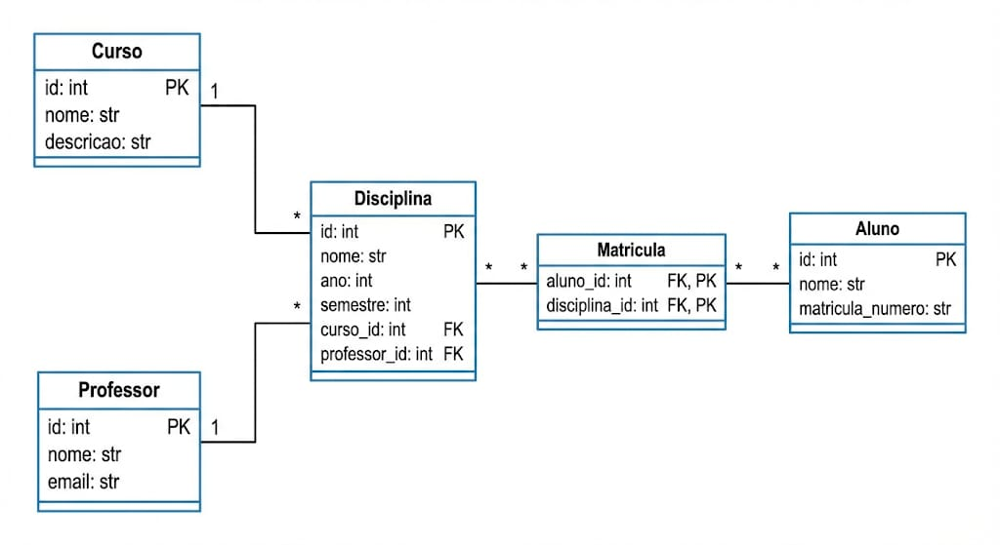

# Sistema de Gestão Acadêmica - FastAPI

Este projeto é uma API Web desenvolvida para a disciplina de **Desenvolvimento de Software para Persistência**. O sistema gerencia o ecossistema acadêmico, permitindo o cadastro de alunos, professores, cursos e disciplinas, além de gerenciar matrículas.

## 📋 Sobre o Projeto

O sistema foi construído utilizando **FastAPI** para alta performance e **SQLModel** para a camada de persistência (ORM). O projeto suporta operações completas de CRUD, consultas complexas com filtros dinâmicos e agregações para dashboards.

### 🛠 Tecnologias Utilizadas
* **Linguagem:** Python 3.12+
* **Framework:** FastAPI
* **ORM:** SQLModel (SQLAlchemy + Pydantic)
* **Migrations:** Alembic
* **Gerenciador de Pacotes:** UV
* **Banco de Dados:** SQLite (Desenvolvimento) / PostgreSQL (Suporte via configuração)

---

## 📊 Diagrama de Classes

Abaixo está a representação da modelagem de dados utilizada no projeto, destacando o relacionamento **Many-to-Many** entre Alunos e Disciplinas através da entidade associativa Matrícula.



---

## 🚀 Como Rodar o Projeto

Este projeto utiliza o **uv** para gerenciamento de dependências.

### 1. Instalação
Clone o repositório e instale as dependências:
```bash
# Instalar dependências e criar ambiente virtual
uv sync
